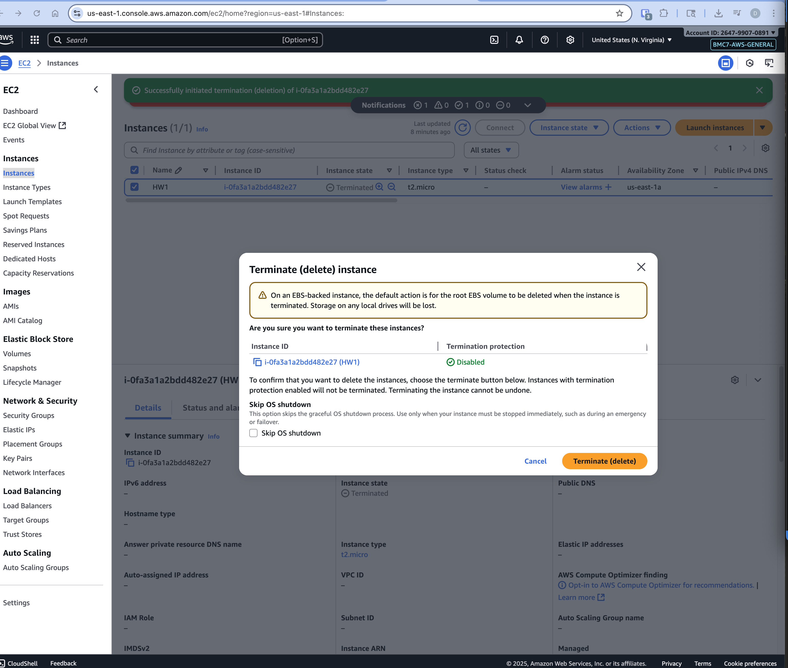

# Prerequisites

- Create a key-pair
- Create a security group that allows port 80 inbound from anywhere

# EC2 Setup

1. Log into the AWS Console
1. Find the EC2 Service and click the [Instances link](https://us-east-1.console.aws.amazon.com/ec2/home?region=us-east-1#Instances:)
1. Click the "Launch Instances" button
1. Use the default values except for the following:
   1. Assign your key-pair
   1. Assign your security group
   1. Paste in your start up script (you will need to expand details)
1. Click the "Launch Instance" button
1. Click the link inside the green toast message to go to your instances details
1. In your instance details find and copy your public DNS name
1. Open a new tab and navigate to your public DNS name _Please make sure to use http not https_

# EC2 Teardown

1. Go to [Instances](https://us-east-1.console.aws.amazon.com/ec2/home?region=us-east-1#Instances:)
1. Find your instance and select the checkbox next to it
1. From the Instance State Menu, Click "Terminate (delete) instance"
   
1. Click the "Terminate (delete)" button
   

# Troubleshooting

- If your site is not loading check the following:
  - You are using http not https
  - Your security group's Inbound rules allow port 80 from anywhere
