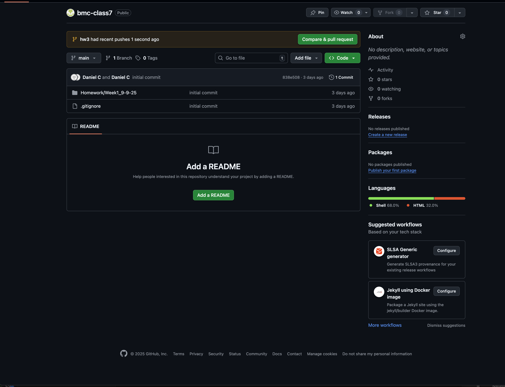
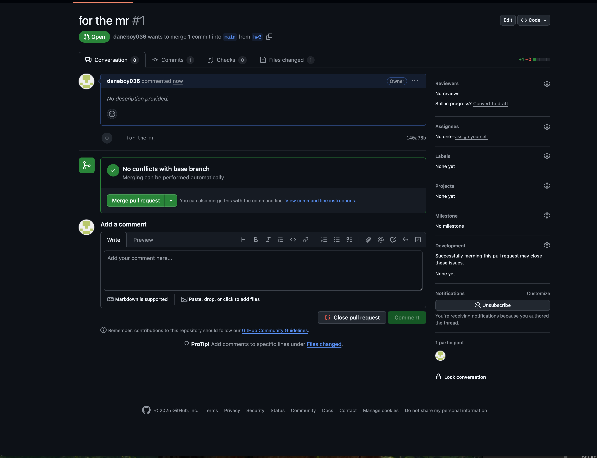
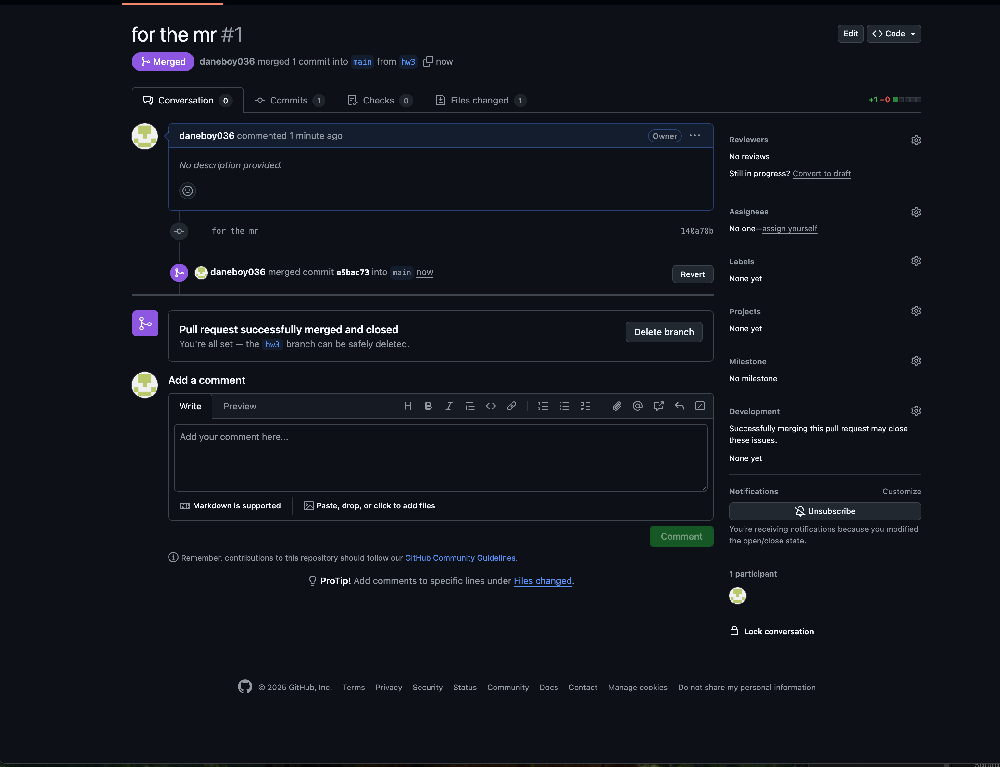

# Overview

This guide will walk you through the process of creating a merge request. In many projects, the main branch will have rules that don't allow users to push changes directly to it. Using merge request gives the opportunity for others to review your work before it's merged into the main branch.

# Steps

1. Create a branch for your changes
   `git checkout -b branchname`
1. Make your changes
1. Add your changes
   `git add .`
1. Commit your changes
   `git commit`
1. Push your branch to your remote repository
   `git push origin branchname`
1. Log into your github account and go to your repository
1. Click the Compare & pull request button
   
1. Add a title and description to your PR
1. In real life you'd have reviewers and once approved you'd merge but in this case just click the Merge pull request button
   
   

And You're Done!!
