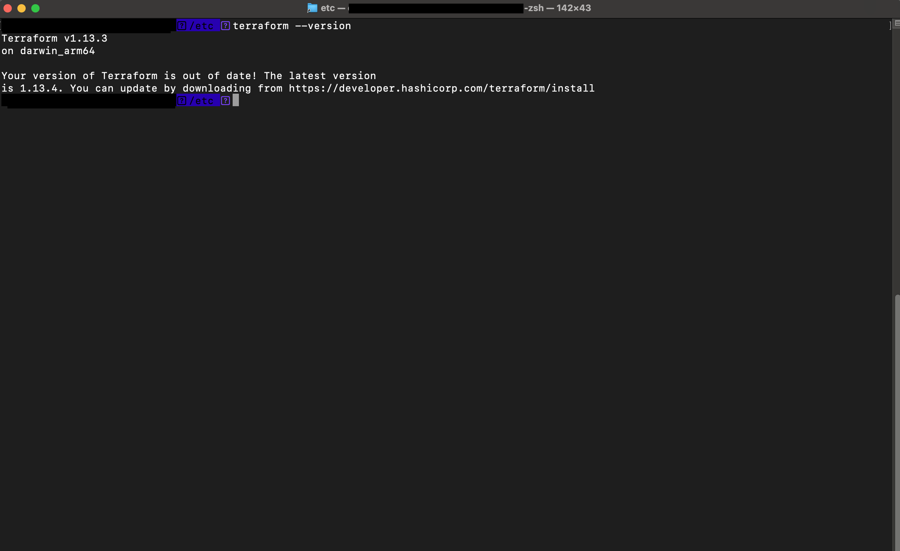
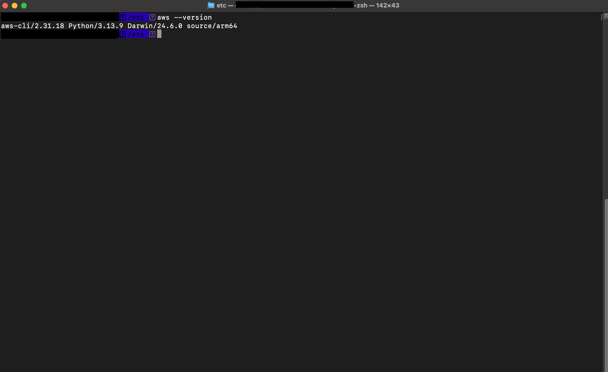
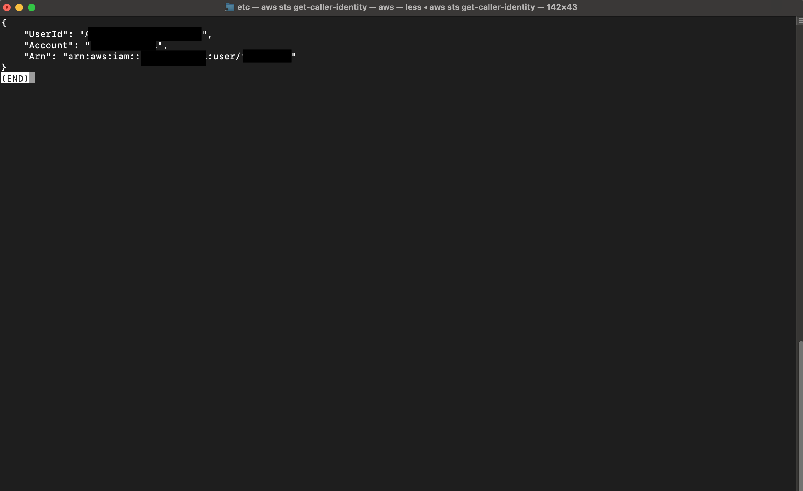
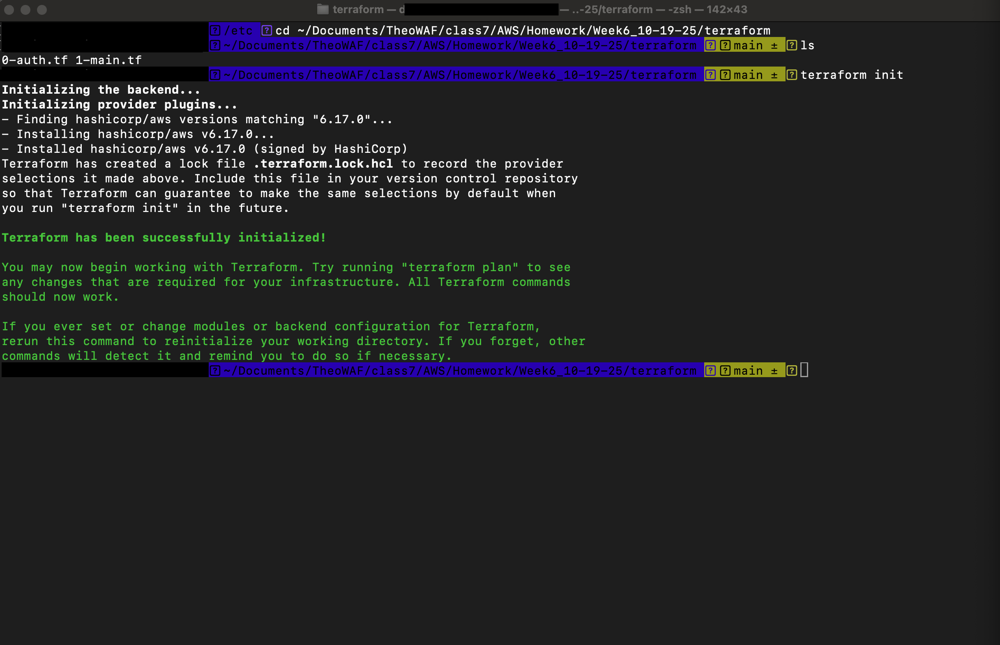
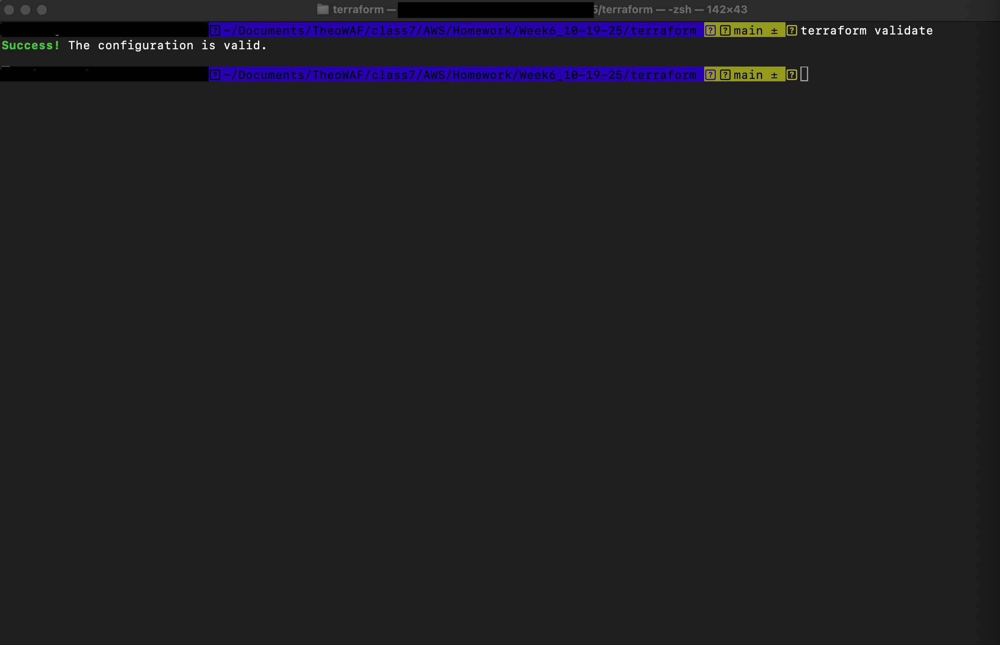
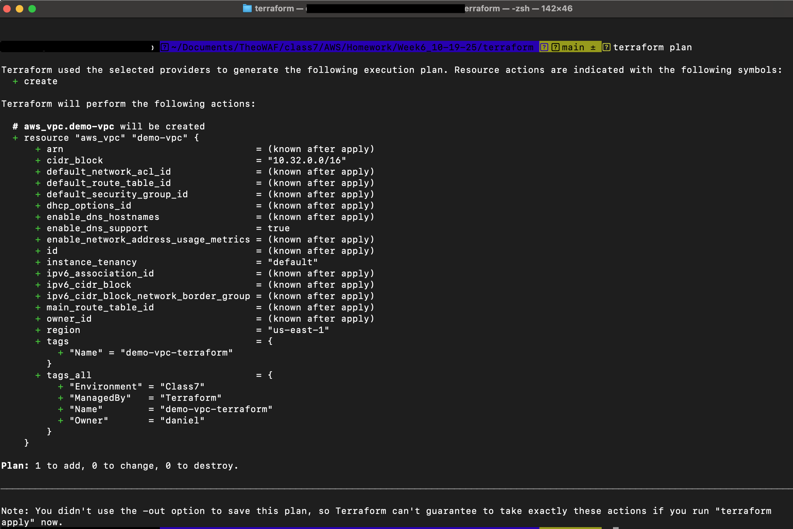
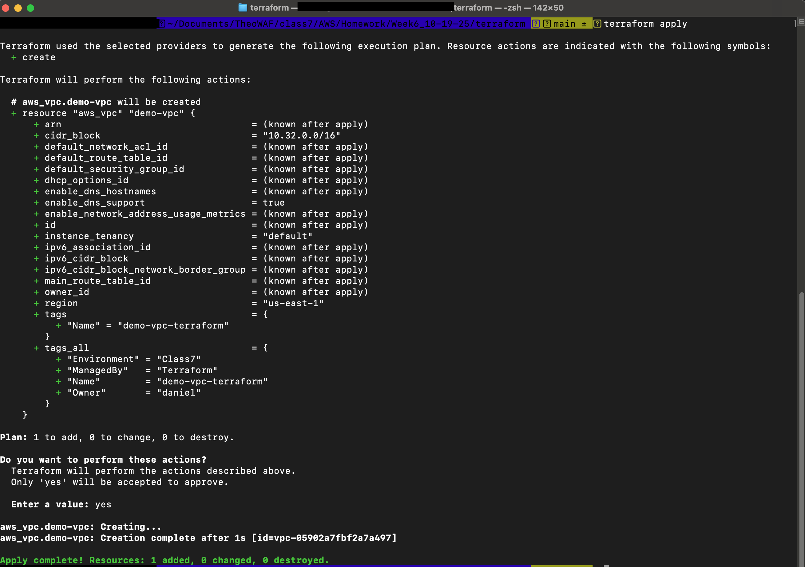
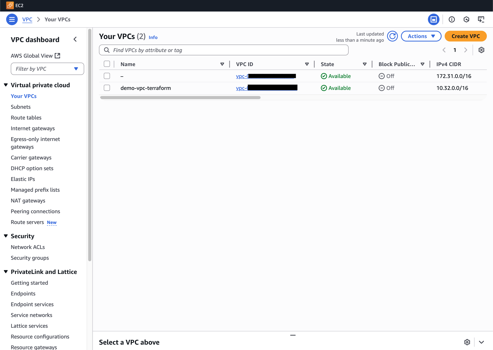

# Installing Terraform

1. Go to the official Terraform installation page [here](https://developer.hashicorp.com/terraform/install).

- Follow the steps for your operating system

# Verify Terraform Installation

1. Open a terminal
   1. For windows users, GitBash is recommended
   1. For linux and mac users, open the default terminal application
1. Run the command `terraform --version`
   

# Verify the AWS CLI is installed

1. Run the command `aws --version`
   

# Verify you have a default AWS Profile configured to use the CLI

1. Run the command `aws sts get-caller-identity`
   The output will look like
   
   _If you get an error then visit [this page]("https://docs.aws.amazon.com/cli/v1/userguide/cli-chap-configure.html") for information on using the cli to configure a profile._

# An AWS Hello World Using Terraform

_We'll use terraform to create a new vpc in our AWS account_

1. Create a directory (ex: `~/terraform/hello-world`)
1. Create a new file called `0-auth.tf`
1. Create a new file called `1-main.tf`
1. Open Visual Studio Code
1. Use the reference files [0-auth.tf](./terraform/0-auth.tf) and [1-main.tf](./terraform/1-main.tf) to complete your files
1. Initialize your terraform project by running `terraform init`
   _After the command runs you'll see a `.terraform` directory and a file called `.terraform.lock.hcl`. DO NOT EDIT OR DELETE THESE FILES_
   
1. Validate your terraform files by running `terraform validate`
   
1. View the plan for your terraform deployment using `terraform plan`
   
1. Apply your terraform deployment using `terraform apply`
   _You'll be prompted to confirm, type yes_
   
   _You'll notice two new files `terraform.tfstate` and `terraform.tfstate.backup`. DO NOT EDIT OR DELETE THESE FILES_

## Verifying your changes

You can verify your changes by logging into the AWS account and viewing your VPCs. You should see a new VPC with a name and CIDR range matching your terraform plan.

_If you do not see your VPC then make sure there were no errors running `terraform apply`_

## Cleanup

From your terraform project's directory run `terrform destory`
_You will be prompted to confirm, type yes_

Finally, check your list of VPCs in AWS and verify that the VPC from this project was deleted

# Additional Terraform Tips

- It's good practice to include a `.gitignore` file that will protect you from uploading sensitive terraform files to your repository
- Do not include any secrets or keys in your terraform files that can accidentally be pushed to your code repository
- When you've finished the contents of your project directory should match:
  
