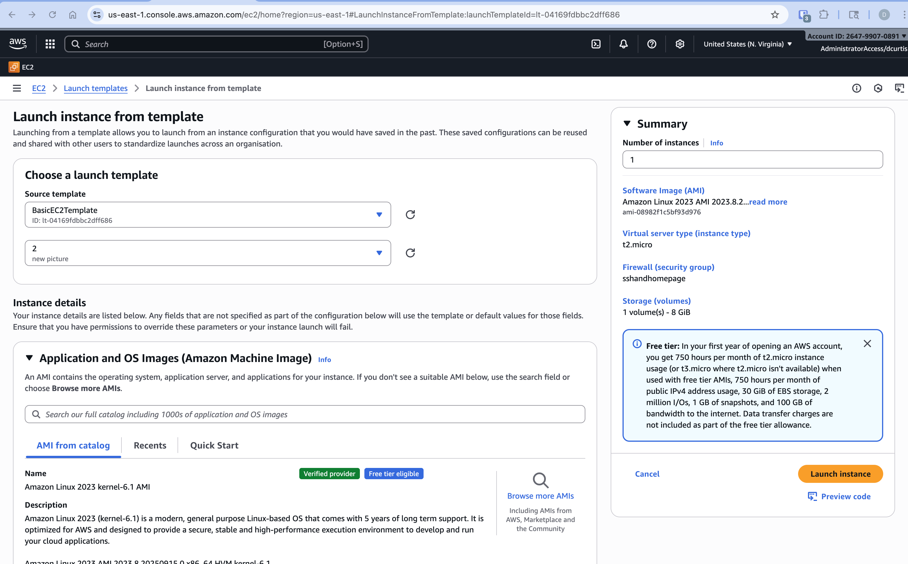

# Overview

In this weeks lab we'll be creating a Launch Template for EC2 Instances. Additionally, we'll create a second version of the template with slighly different user data.

# Prerequisites

1. Create an EC2 instance
   1. The instance should include a security group
   1. The instance should have a key pair associated with it
1. Create a Security Group with the below inbound rules HTTP open to all IPv4 Addresses SSH open to all IPv4 Addresses
   \*\* For Help creating an instance see [Lab - Create an EC2 Instance.md](<Lab - Create an EC2 Instance.md>)

# Steps

## Creating the template

1. Go back to the [EC2 Service -> Instances](https://us-east-1.console.aws.amazon.com/ec2/home?region=us-east-1#Instances:)
1. Right Click on your instance and then select Images and templates -> 
1. Double check all the settings (including making sure your Key Pair and Security Groups are correct)
1. Under the Advanced Details paste in your user data
1. Click the orange "Create launch template" button
1. [View your launch template](https://us-east-1.console.aws.amazon.com/ec2/home?region=us-east-1#LaunchTemplates:)
1. Right click on your instance and choose Launch instance from template
   1. 
   1. Check your settings and Click "Launch instance"
1. View you instances
1. Click your instance and copy the Public DNS value
   
1. Open a new tab and paste in the Public DNS value you copied (use http not https)
   

## Creating a New Version of the Template

1. [View your launch template](https://us-east-1.console.aws.amazon.com/ec2/home?region=us-east-1#LaunchTemplates:)
1. Right click on your template and select Modify template (Create new version)
1. In the advanced details edit your user data
1. Click Create Template
1. View your templates -> Right click on the template and choose Launch instance from template
1. Make sure to select version 2 and click Launch instance
   
1. When the instance is running visit the pubic DNS to view your site
   

# Tear Down

1. Delete your templates
1. Terminate your intances

# Troubleshooting

- Make sure that you're using http not https when connecting to your website
- Make sure that you've assigned a public IP to your instance

# Resources

## User Data Base

```bash
#!/bin/bash
# Use this for your user data (script from top to bottom)
# install httpd (Linux 2 version)
yum update -y
yum install -y httpd
systemctl start httpd
systemctl enable httpd

# Get the IMDSv2 token
TOKEN=$(curl -X PUT "http://169.254.169.254/latest/api/token" -H "X-aws-ec2-metadata-token-ttl-seconds: 21600")

# Background the curl requests
curl -H "X-aws-ec2-metadata-token: $TOKEN" -s http://169.254.169.254/latest/meta-data/local-ipv4 &> /tmp/local_ipv4 &
curl -H "X-aws-ec2-metadata-token: $TOKEN" -s http://169.254.169.254/latest/meta-data/placement/availability-zone &> /tmp/az &
curl -H "X-aws-ec2-metadata-token: $TOKEN" -s http://169.254.169.254/latest/meta-data/network/interfaces/macs/ &> /tmp/macid &
wait

macid=$(cat /tmp/macid)
local_ipv4=$(cat /tmp/local_ipv4)
az=$(cat /tmp/az)
vpc=$(curl -H "X-aws-ec2-metadata-token: $TOKEN" -s http://169.254.169.254/latest/meta-data/network/interfaces/macs/${macid}/vpc-id)

echo "
<!doctype html>
<html lang=\"en\" class=\"h-100\">
<head>
<title>Details for EC2 instance</title>
</head>
<body>
<div>
<h1>AWS Instance Details</h1>
<h1>Samurai Katana</h1>

<br>
# insert an image or GIF

<br>

<p><b>Instance Name:</b> $(hostname -f) </p>
<p><b>Instance Private Ip Address: </b> ${local_ipv4}</p>
<p><b>Availability Zone: </b> ${az}</p>
<p><b>Virtual Private Cloud (VPC):</b> ${vpc}</p>
</div>
</body>
</html>
" > /var/www/html/index.html

# Clean up the temp files
rm -f /tmp/local_ipv4 /tmp/az /tmp/macid
```
